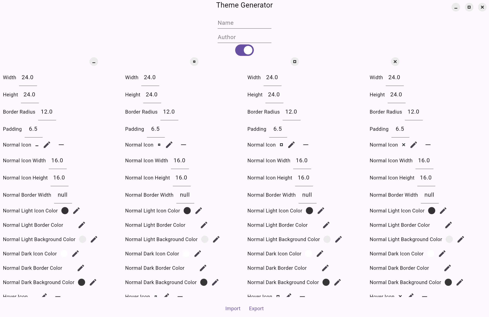

# Linux CSD Buttons

Client-Side Decoration window controls for Linux, fully customizable via JSON themes.


[Live Demo (Theme Generator)](https://theme-generator.pages.dev)

## Installation

Add this to your `pubspec.yaml`:

```yaml
dependencies:
  window_manager: ^0.5.1 # Recommended for window actions (close, min, max)
  handy_window: ^0.4.0 # Recommended for rounded window corners
  linux_csd_buttons: ^1.0.0
```

## Usage

```dart
import 'dart:convert';
import 'package:flutter/material.dart';
import 'package:linux_csd_buttons/linux_csd_buttons.dart';
import 'package:window_manager/window_manager.dart';

// Load theme data from a JSON object using CsdTheme.fromJson()
class LinuxTitleBarButtons extends StatefulWidget {
  final CsdTheme theme;
  const LinuxTitleBarButtons({super.key, required this.theme});

  @override
  State<LinuxTitleBarButtons> createState() => _LinuxTitleBarButtonsState();
}

class _LinuxTitleBarButtonsState extends State<LinuxTitleBarButtons> with WindowListener {
  bool _isMaximized = false;

  @override
  void initState() {
    super.initState();
    windowManager.addListener(this);
  }

  @override
  void dispose() {
    windowManager.removeListener(this);
    super.dispose();
  }

  @override
  void onWindowMaximize() => setState(() => _isMaximized = true);
  @override
  void onWindowUnmaximize() => setState(() => _isMaximized = false);

  @override
  Widget build(BuildContext context) {
    return Row(
      children: [
        CsdButton(
          theme: widget.theme,
          type: CsdButtonType.minimize,
          onPressed: () => windowManager.minimize(),
        ),
        CsdButton(
          theme: widget.theme,
          type: _isMaximized ? CsdButtonType.restore : CsdButtonType.maximize,
          onPressed: () => _isMaximized ? windowManager.unmaximize() : windowManager.maximize(),
        ),
        CsdButton(
          theme: widget.theme,
          type: CsdButtonType.close,
          onPressed: () => windowManager.close(),
        ),
      ],
    );
  }
}
```


## Theme Structure

```jsonc
{
  "name": "My Theme", // Optional
  "author": "me", // Optional
  "close": {
    "borderRadius": 12.0,
    "padding": 6.5,
    "size": 24.0, // or "width": 24.0 and "height": 24.0
    "iconSize": 16.0, // Icon size inside the button
    "normal": {
      "icon": "<svg>...</svg>",
      "borderWidth": null,
      "light": {
        "iconColor": 3422552064, // ARGB color as integer
        "borderColor": null,
        "backgroundColor": 4293651435
      },
      "dark": {
        "iconColor": 4294967295,
        "borderColor": null,
        "backgroundColor": 4281808695
      }
    },
    "hover": {...},
    "pressed": {...}
  },
  "minimize": {...},
  "maximize": {...},
  "restore": {...}
}
```